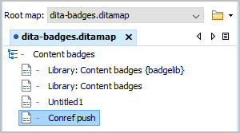
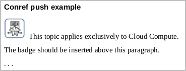

# Referencing badges in shared topics

What happens when the badged topics that support your three-product context get referenced by someone from another product group? At a minimum, they'll get a build error (missing key or reference). Ultimately their customers will not understand what is going on. 

Be practical. Badging is a work-around and will not scale beyond a workgroup. Clone the shared topic, remove the badges from the clone, and move on.

If you *must* share a badged topic across teams but do not want the badges to appear in all contexts, consider one of the more underutilized reuse mechanisms in DITA, conref push. 

By default, @conrefs and @conkeyrefs "pull" referenced content into the current topic. @Conref push and @conkeyref push insert referenced content into a specific location in a target topic. 

For example, let's say that a topic named `Untitled1.dita` contained the following section.

```xml
<section>
  <title>Conref push example</title>
  <p id="p_first-para">The badge should be inserted above this paragraph. </p>
  <p>. . . </p>
</section>
```

In its current state, this markup generates the following output.


To "push" a section-level badge into a target topic named `Untitled1.dita`, you need to create a separate topic that defines what you want to push into the target topic and where it should be inserted. Let's call that topic `conrefpush.dita`. 



Set the @processing-role attribute of `conrefpush.dita` to "resource-only" in the map so the conref push topic does not appear alongside other content topics. 


Setting this attribute makes `conrefpush.dita` available to the DITA map and to the DITA processor, but not visible to the customer.  

To "push" a badge into `Untitled1.dita` before the section paragraph with `@id="first-para"`, insert the following markup into `conrefpush.dita`. 

```xml
<p conaction="pushbefore">
  <image href="images/badge_cloud-compute_small_yes.png">
    <alt>This topic applies exclusively to Cloud Compute.</alt>
  </image>
  <ph> This topic applies exclusively to Cloud Compute.</ph>
</p>
<p conaction="mark" conref="Untitled1.dita#untitled/p_first-para" />
```

Before build time, you see no change in target topic content. At build time, the paragraph with `conaction="pushbefore"` instructs the DITA processor to insert the badge defined in this paragraph *before* a target paragraph element. The second paragraph specifies that target element (insertion point) as `<p id="p_first-para"> The badge should be inserted above this paragraph.</p>`. The processed output now includes a badge that was never inserted directly into the topic. 



This would be the location where you would insert a section-level badge manually. If another team references `Untitled1.dita` without referencing `conrefpush.dita`, the badge never appears in their generated output.  

As with many of these gee-whiz features in DITA, you need to weigh the benefits of implementing conref push against the complexity that it introduces. Some technical solutions create more governance problems than they are worth. 