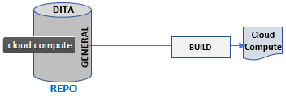
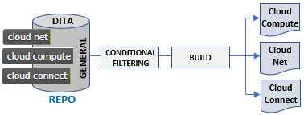

# A typical use case for content badging

A startup named CloudSquared develops resource monitoring software for cloud-based frameworks. For its first product, Cloud Compute Monitoring, the content development team develops a complete documentation set.



A year later CloudSquared releases Cloud Net Monitoring so the content development team uses DITA conditional filtering to publish separate Cloud Compute and Cloud Net publications. 


Content developers assign filtering attributes such as `product="cloud-compute"` or `product="cloud-net"` to topics, sections, or elements that need to be filtered OUT of a product-specific deliverable. 

The following year, CloudSquared releases Cloud Connect and completes the monitoring suite. The writing team then uses conditional filtering to publish three separate publications. 



Content developers add the filtering attribute `product="cloud-connect"` to those topics, sections, or elements that need to be filtered OUT of the other two product-specific deliverables. 

Six months after this launch, Marketing receives feedback that emphasizing common design and services across the three suite components will enhance customer perception that CloudSquared can consolidate its achievements and move on to new product lines. Toward that end, Product Management requests that the content development team consolidate the three, product-specific publications into one, multi-product publication. Both generic and product-specific information would need to appear in the same deliverable.


When transitioning from conditional filtering to badging, note that filtering metadata is *useful* in identifying where product-specific information lives in your sources but *useless* as markup to implement badging. In DITA, the logic to include or exclude elements tagged with filtering attributes such as @product or @audience lives in DITAVAL scripts outside the DITA topics themselves.  

Filtering markup in a topic: 

```xml
<p product="cloud-connect">Cloud Connect is great.</p>
```

Filtering markup in a DITAVAL script:

```xml
<val>
   <prop att="product" val="cloud-connect" action="exclude" />
</val>
```

Badging markup: 

```xml
<p id="p_badge_icon_cloud-connect_section_yes">
  <image href="images/badge_cloud-connect_small_yes.png"></image>
  <ph>This section applies exclusively to Cloud Connect.</ph>
</p>
<p>Cloud Connect is great.</p>
```

Filtering does a brilliant job supporting a many-to-one relationship between source content and delivered content. Many product-specific variations are filtered out to produce that one product-specific deliverable. Badging involves a many-to-many relationship. All the product-specific variations in the sources need to be accounted for in a multi-product deliverable.   

The real challenges with badging involve logic.  
